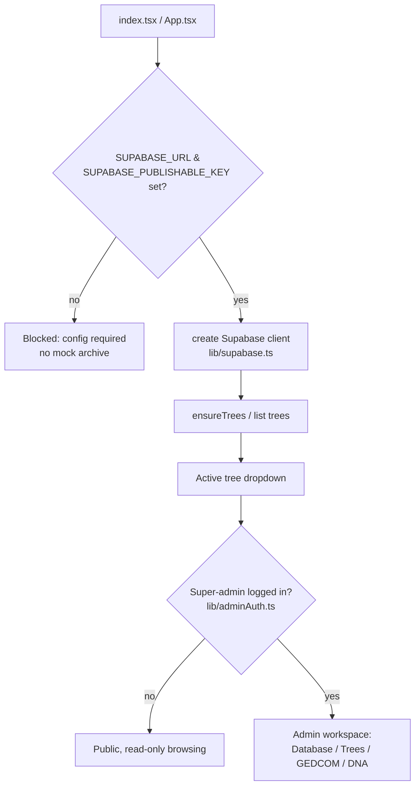
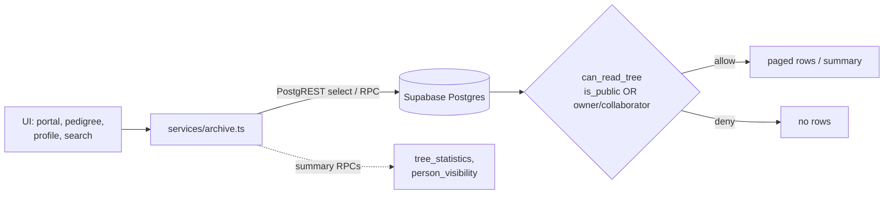
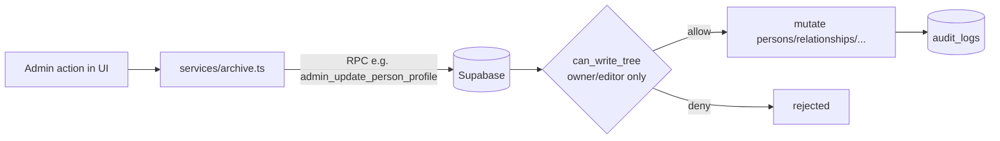
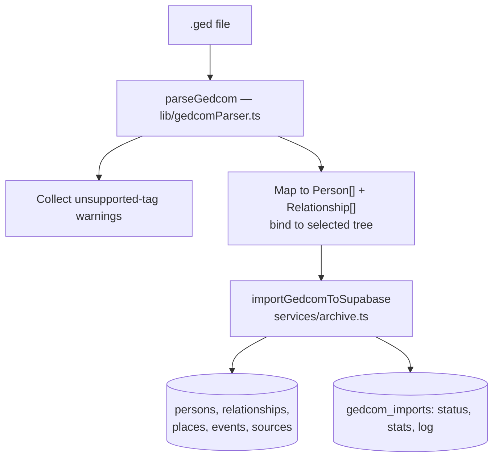
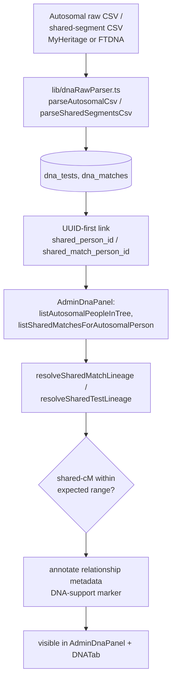
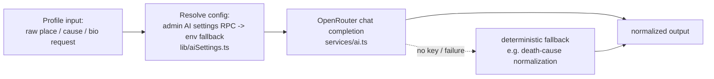
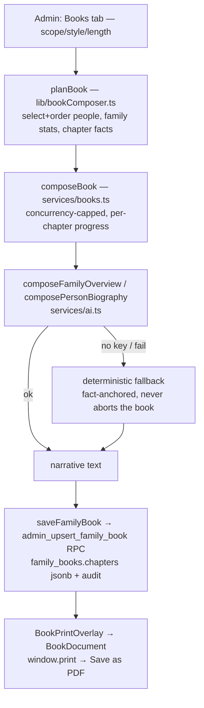

# Architecture

Linegra is a single-page React/Vite app talking directly to Supabase (PostgREST + RPC)
under Row-Level Security, with OpenRouter used for opt-in AI text utilities. There is no
custom backend server — Supabase **is** the backend. This page captures the six flows that
matter most.

Key entry files: [../index.tsx](../index.tsx), [../App.tsx](../App.tsx),
[../lib/supabase.ts](../lib/supabase.ts), [../services/archive.ts](../services/archive.ts),
[../services/ai.ts](../services/ai.ts). See [../docs/CONTENT_MAP.md](../docs/CONTENT_MAP.md)
for the full feature→file map and [schema.md](schema.md) for the data model.

## 1. App shell / boot gate

The app refuses to render until Supabase env is present, then loads trees and branches into
public-browse vs admin-edit based on local super-admin state.

## 2. Read path (public-first, no full-tree hydration)

Default views use paged/targeted queries and RPC summaries so large trees stay snappy. RLS
`can_read_tree()` gates every row.

Representative reads: `loadArchiveData`, `fetchTreeStatistics`, `fetchPersonConnections`,
`fetchPersonDetails`, `searchPersonsInTree`, landing widgets (`fetchWhatsNewPeople`,
`fetchThisMonthHighlights`, `fetchMostWantedPeople`, `fetchRandomMediaPeople`) — all in
[../services/archive.ts](../services/archive.ts).

## 3. Write path (admin → RPC → RLS → audit)

Mutations are admin-only and routed through RPCs/inserts gated by `can_write_tree()`, with
changes recorded to `audit_logs`.

Representative writes/RPCs: `admin_update_person_profile`, `admin_update_relationship_details`,
`admin_set_relationship_confidence`, `admin_unlink_relationship`, `admin_create_tree`,
`admin_update_tree_settings`, `admin_delete_tree`, `admin_nuke_database`,
`admin_upsert_person_dna_tests`. See [schema.md](schema.md#rpc-catalog).

## 4. GEDCOM import pipeline

GEDCOM is parsed client-side into `{people, relationships}` then persisted in one admin
operation. Parsing is the pure module `lib/gedcomParser.ts`; the import component wires it to
the file input and the persistence call.

Files: [../lib/gedcomParser.ts](../lib/gedcomParser.ts) (pure `parseGedcom` + `serializeGedcom`
for export),
[../components/ImportExport.tsx](../components/ImportExport.tsx),
[../components/admin/AdminGedcomPanel.tsx](../components/admin/AdminGedcomPanel.tsx),
`importGedcomToSupabase` in [../services/archive.ts](../services/archive.ts). Details:
[integrations/gedcom.md](integrations/gedcom.md), [runbooks/gedcom-import.md](runbooks/gedcom-import.md).

## 5. DNA lineage pipeline

CSV imports become `dna_tests` / `dna_matches`; the admin DNA panel resolves the shortest
plausible lineage path between two testers and checks shared-cM compatibility, then annotates
relationship metadata with DNA-support markers.

Files: [../lib/dnaRawParser.ts](../lib/dnaRawParser.ts),
[../components/AdminDnaPanel.tsx](../components/AdminDnaPanel.tsx),
[../components/person-profile/DNATab.tsx](../components/person-profile/DNATab.tsx),
resolvers in [../services/archive.ts](../services/archive.ts). Details:
[concepts/dna-lineage-verification.md](concepts/dna-lineage-verification.md),
[integrations/dna-csv-formats.md](integrations/dna-csv-formats.md),
[sources/dna-cm-ranges.md](sources/dna-cm-ranges.md).

## 6. AI utility flow (OpenRouter, opt-in)

AI is used only for discrete text utilities (biography drafting, place-string parsing,
historical-era context, cause-of-death normalization). Settings resolve from a central
Supabase-backed admin record with env fallback; a deterministic fallback exists for
cause-of-death so the feature degrades gracefully without a key.

Functions: `generateBio`, `parsePlaceString`, `analyzeHistoricalEra`, `normalizeDeathCause`,
`testOpenRouterConnection`, `hasOpenRouterConfig` in [../services/ai.ts](../services/ai.ts);
settings in [../lib/aiSettings.ts](../lib/aiSettings.ts). Details:
[concepts/ai-assisted-normalization.md](concepts/ai-assisted-normalization.md),
[integrations/openrouter.md](integrations/openrouter.md).

## 7. AI Family Book flow (compose → persist → print)

An admin composes a narrative family-history book from a tree; each life is set in its historical
context (era, region, occupation). The book is persisted to `family_books` and exported to PDF via
native print. Planning is pure/tested; AI composition degrades to deterministic fallbacks per
chapter, so a full book generates with no API key.

Files: [../lib/bookComposer.ts](../lib/bookComposer.ts) (pure planning),
[../services/books.ts](../services/books.ts) (orchestration + persistence),
[../services/ai.ts](../services/ai.ts) (`composeFamilyOverview`, `composePersonBiography` + the
`deterministic*` fallbacks), [../components/admin/BookComposerPanel.tsx](../components/admin/BookComposerPanel.tsx),
[../components/book/BookDocument.tsx](../components/book/BookDocument.tsx) +
[../components/book/BookPrintOverlay.tsx](../components/book/BookPrintOverlay.tsx), print CSS in
[../index.css](../index.css), schema in
[`20260620180000_family_books.sql`](../supabase/migrations/20260620180000_family_books.sql). Details:
[concepts/ai-family-books.md](concepts/ai-family-books.md).

## Cross-cutting invariants

- **Boot requires Supabase env** — no in-app connection form, no mock archive.
- **RLS is the authorization boundary** — `can_read_tree` / `can_write_tree`; UI checks are
  convenience only. See [decisions/supabase-rls-can-read-write.md](decisions/supabase-rls-can-read-write.md).
- **UUIDs are authoritative** across all entities (including DNA linking).
- **Snappy by construction** — avoid full-tree hydration; prefer paged queries + RPC summaries.
- **Audit everything mutating** via RPC/trigger writes to `audit_logs`.
