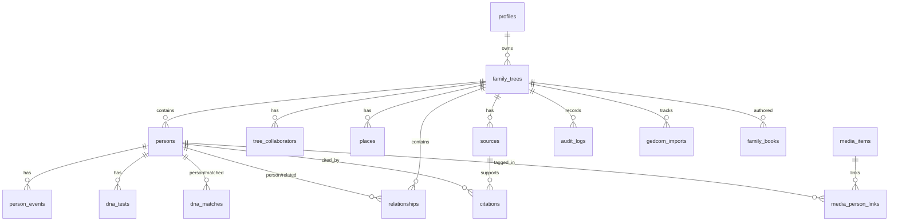

# Schema

Authoritative DB model lives in [../supabase/migrations/](../supabase/migrations/). The
bootstrap is [`20260207090000_init_schema.sql`](../supabase/migrations/20260207090000_init_schema.sql);
later migrations add RPCs, policy fixes, and DNA shared-autosomal support. TypeScript
mirrors are in [../types.ts](../types.ts). Apply changes with `supabase db push` (see
[runbooks/supabase-migrations.md](runbooks/supabase-migrations.md)).

## Core rules / invariants

- **UUIDs are authoritative** identifiers across all entities.
- **RLS enabled** on every public table; reads gated by `can_read_tree(tree_id)`, writes by
  `can_write_tree(tree_id)` (both `security definer`, `search_path = public`).
- A tree is readable if `is_public`, or the caller is `owner_id`, or an `active`
  collaborator. Writable only by `owner` / `editor` collaborators (or owner).
- Mutations are logged to `audit_logs` (directly or via RPC).
- `*_text` columns store the raw/fuzzy genealogical value alongside the parsed typed column
  (e.g. `birth_date` vs `birth_date_text`) to preserve fidelity of uncertain data.

## Enumerations

| Enum | Values |
| --- | --- |
| `gender_type` | M, F, O |
| `relationship_type` | marriage, partner, bio_father, bio_mother, adoptive_father, adoptive_mother, step_parent, guardian, child |
| `relationship_status` | current, divorced, separated, widowed |
| `relationship_confidence` | Confirmed, Probable, Assumed, Speculative, Unknown |
| `source_type` | Book, Church Record, Probate Register, Website, Census, Vital Record, Military Record, Unknown |
| `note_type` | Generic, To-do, Research Note, Discrepancy |
| `media_type` | image, audio, video, document |
| `media_source` | local, remote |
| `media_category` | Portrait, Family, Location, Document, Event, Other |
| `dna_test_type` | Autosomal, Y-DNA, mtDNA, X-DNA, Other |
| `dna_vendor` | FamilyTreeDNA, AncestryDNA, 23andMe, MyHeritage, LivingDNA, Other |
| `dna_match_confidence` | High, Medium, Low |
| `import_status` | pending, processing, completed, failed |

## Tables



| Table | Purpose / notable columns |
| --- | --- |
| `profiles` | Mirror of `auth.users` (id, full_name, display_name, avatar_url, role). Populated by `handle_new_user` trigger. |
| `family_trees` | Top container. `owner_id`, `is_public`, `theme_color`, `metadata`, `archived_at`. Unique on `lower(name)`. |
| `tree_collaborators` | Per-tree access grants: `profile_id`/`invitation_email`, `role` (owner/editor/...), `status`. **Schema-ready collaboration; no UI yet.** |
| `places` | Structured place records (street/city/county/state/country, lat/lng). Persons reference via `*_place_id` with `*_place_text` fallback. |
| `persons` | Core individual. Names, gender, birth/death/burial date+place (typed + `_text`), `death_cause` + `death_cause_category`, `bio`, `occupations[]`, `tags[]`, `is_dna_match`, `dna_match_info`, `metadata`. Indexed by tree + lower(name). |
| `person_events` | Timeline events (`event_type`, date(+text), place(+text), description, employer). |
| `relationships` | Directed `person_id → related_id` of `type`, with `status`, `confidence`, `sort_order`, `metadata` (holds DNA-support markers). |
| `sources` | Source records: title, type, repository, url, `reliability` (1–3), `actual_text`. |
| `citations` | Link a source to a person/event/relationship (target check constraint requires at least one). |
| `notes` | Typed notes attached to person/event/relationship; `is_private` hides from public. |
| `media_items` | Media (url, type, source, category, caption, `taken_at`, `metadata`). |
| `media_person_links` / `media_event_links` / `media_relationship_links` | Many-to-many media attachments. Person link PK includes `event_label`. |
| `dna_tests` | Per-person test: `test_type`, `vendor`, dates, `haplogroup`, `is_private`. |
| `dna_matches` | `person_id`/`matched_person_id`, `shared_cm`, `segments`, `longest_segment`, `confidence`. |
| `audit_logs` | `actor_id`/`actor_name`, `action`, `entity_type`, `entity_id`, `details`. Indexed by tree + created_at desc. |
| `gedcom_imports` | Import run tracking: `status`, `stats`, `log`, `completed_at`. |
| `family_books` | AI-authored family-history books per tree: `title`, `subtitle`, `status` (draft/complete), `is_public`, `options`/`chapters`/`statistics` (jsonb — `chapters` is `[{kind,title,personId?,narrative,facts?}]` so a future editor can reopen/regenerate), `created_by_*`. RLS: readable if `can_read_tree` AND (`is_public` OR `can_write_tree`) — **v1 admin/editor-only** (books may weave in living-person data). |
| `person_biographies` | One evolving biography per `(person_id, language)`: `narrative`, `signature` (content hash for change detection), `style`/`length`/`model`, `is_manual`. Books are compiled from these (only changed people are re-generated). RLS: `can_read_tree` to read, `can_write_tree` to write. Migration `20260621120000_person_biographies.sql`. |

## RLS helper functions

```sql
can_read_tree(tree_id)  -- is_public OR owner OR active collaborator
can_write_tree(tree_id) -- auth.uid() AND (owner OR active owner/editor collaborator)
```

Both are `security definer`. Policies follow a uniform pattern: direct-tree tables use
`can_*_tree(tree_id)`; child tables (e.g. `person_events`) check via an `exists` join to the
owning person's tree. See lines ~335–445 of the init migration.

## RPC catalog

Defined across [../supabase/migrations/](../supabase/migrations/):

| RPC | Role |
| --- | --- |
| `can_read_tree`, `can_write_tree` | RLS predicates (above). |
| `handle_new_user` | Trigger: provision `profiles` row on signup. |
| `person_visibility` | Resolve public/private visibility for a person. |
| `tree_statistics` | Aggregate counts/benchmarks for the landing page. |
| `admin_create_tree`, `admin_update_tree_settings`, `admin_delete_tree`, `admin_list_trees_with_counts` | Tree CRUD + owner/visibility settings + counts. |
| `admin_update_person_profile` | Profile mutation entrypoint (audited). `payload_citations` rebuilds a person's source citations (one source → many events); when absent, the legacy one-citation-per-source path runs. |
| `admin_merge_sources` | Consolidate duplicate `sources` rows into a canonical one (repoints citations, collapses dupes, deletes the rest; validates `can_write_tree`, audited). |
| `admin_update_relationship_details`, `admin_set_relationship_confidence`, `admin_unlink_relationship` | Relationship edits. |
| `admin_upsert_person_dna_tests` | Persist DNA tests for a person. |
| `admin_list_tree_shared_autosomal_tests` | Feed the admin DNA panel. |
| `admin_get_ai_settings_metadata`, `admin_get_ai_runtime_settings`, `admin_upsert_ai_settings` | Central admin AI settings (OpenRouter). |
| `admin_upsert_family_book`, `admin_delete_family_book` | Family-book save/delete (validates `can_write_tree`, audited). Reads via plain PostgREST on `family_books` (RLS). |
| `admin_upsert_person_biography` | Upsert one person's biography for a language (keyed person+language, validates `can_write_tree`, audited). Reads via PostgREST on `person_biographies`. |
| `admin_nuke_database` | Destructive full reset (guarded). |
| `jsonb_object_length` | Compatibility shim used by DNA/relationship metadata logic. |

> When adding a table/column/RPC: add a migration, update this page, update
> [../types.ts](../types.ts), and (if it changes navigation) [../docs/CONTENT_MAP.md](../docs/CONTENT_MAP.md).
